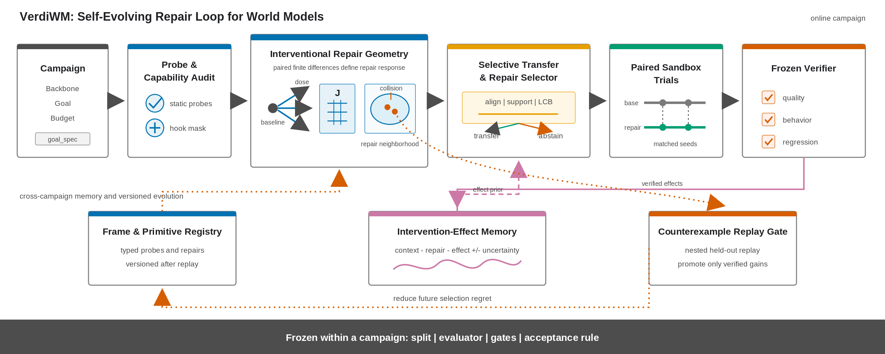

# VerdiWM

VerdiWM is an evidence-grounded research loop for diagnosing and repairing
world models. It turns a user goal into a frozen evaluation contract, probes a
model for failure mechanisms, compiles bounded intervention primitives into
runtime changes, validates them at progressive fidelity, and retains positive,
null, and harmful effects for later transfer.



The repository is an early research release. It contains a working control
plane, typed intervention and evidence contracts, ACWM-Phys and Ctrl-World ACWM
adapters, 17 materialized intervention primitives, an initial Interventional
Repair Geometry (IRG) implementation, and one integrity-checked operational
closed-loop example.

## What is implemented

| Surface | Release status |
|---|---|
| Goal, probe, proposal, trial, verdict, and evidence schemas | Implemented |
| Fail-closed intervention compilation and runtime receipts | Implemented |
| Diagnosis, proposal, budgeted execution, independent verification, archive | Implemented |
| Per-environment horizon ladder and frozen verifier checks | Implemented |
| IRG local response charts and distances | Implemented, unit tested |
| Transfer certificate with explicit abstention | Implemented, unit tested |
| Intervention-Effect Memory and counterexample discovery | Implemented, unit tested |
| ACWM-Phys operational minimal loop | Included as a public evidence bundle |
| Ctrl-World ACWM predictive-quality protocol | Frozen public packet; runtime receipts pending |
| Multi-seed causal replication of the bundled effect | Not established |
| Cross-backbone IRG alignment and calibrated transfer | Research work in progress |
| Autonomous atlas evolution validated on new backbones | Research work in progress |

This distinction is intentional: code availability is not treated as empirical
validation.

## Core loop

1. **Compile intent.** A user objective is converted into a versioned goal,
   metric roles, held-out protocol, resource budget, and immutable verifier.
2. **Diagnose.** Verdict probes measure success; diagnostic probes localize
   likely mechanisms without being allowed to decide acceptance.
3. **Compile an intervention.** A semantic primitive is admitted only when the
   target backbone exposes the required hook and all invariants are checked.
4. **Test progressively.** Cheap screens precede the frozen official gate and
   checkpoint/seed confirmation.
5. **Settle evidence.** Every verdict is tied to a receipt. Missing evidence,
   protocol drift, or failed gates yields rejection or abstention.
6. **Retain effects.** Confirmed, null, harmful, and interaction effects remain
   context-local in memory and become transfer priors only under a certificate.
7. **Evolve the atlas.** Nearby contexts with opposing repair effects create
   counterexamples that prioritize new diagnostic directions.

See [Architecture](docs/ARCHITECTURE.md) and
[Method to code](docs/METHOD_TO_CODE.md) for the detailed mapping. To bring up
a different model family, follow the fail-closed
[backbone instantiation guide](docs/BACKBONE_INSTANTIATION.md).

## Quick start

VerdiWM's CPU control plane requires Python 3.10.

```bash
python -m pip install uv
uv sync --all-groups
bash scripts/ci/check_control_plane.sh
```

Validate the checked-in public evidence bundle:

```bash
uv run python scripts/export/validate_public_example.py \
  examples/acwm_minimal_loop_cloth_next_forcing_v2
```

Run the IRG tests directly:

```bash
uv run pytest -q tests/test_verdiwm_geometry.py
```

GPU execution is adapter-specific. ACWM-Phys data and checkpoints are not
redistributed here; follow the upstream projects and then pass their roots to
the corresponding execution command. See
[Reproducibility](docs/REPRODUCIBILITY.md).

## Minimal closed-loop evidence

[`examples/acwm_minimal_loop_cloth_next_forcing_v2`](examples/acwm_minimal_loop_cloth_next_forcing_v2)
contains a diagnosis, an intervention receipt, a 512-step screen, a frozen
official 50-step gate, checkpoint confirmation, a long-horizon effect profile,
an experience-map entry, and a three-column video.

For `cloth_move + next_forcing` it records:

- 512-step screen AUC delta: `+11.9055`
- official 50-step PSNR delta: `+0.79 dB`
- selected checkpoint PSNR delta: `+0.94 dB`
- long-horizon PSNR deltas: `+1.5883`, `+1.3677`, and `+1.0753 dB` at horizons 16, 32, and 48

The initial and confirmation evaluations share evaluation seed `2802`.
Therefore this bundle proves an operational minimal loop and a local paired
effect, not a paper-level replicated causal effect. The upstream cloth
checkpoint also has a published-step metadata inconsistency, so this result is
restricted to paired deltas against the exact frozen checkpoint.

## Public experience snapshot

[`examples/acwm_experience_atlas_v1`](examples/acwm_experience_atlas_v1)
retains the current ACWM-Phys exploration ledger in a path-safe form. It
contains 284 completed screens, 874 per-horizon measurements, 22 deduplicated
experience records from 25 source maps, and four official-gated
`GT | Baseline | Repair` showcase cases. Positive, null, and harmful screens
are all retained so failed interventions are not silently rediscovered.

Screen labels are triage evidence, not paper results. The four showcase cases
carry separate official-gate and confirmation evidence; experience-atlas
records remain context-local routing priors unless causal credit is explicitly
established.

## Method evidence maps

[`examples/acwm_method_evidence_maps_v1`](examples/acwm_method_evidence_maps_v1)
links the current environment-by-primitive official-gate matrix to the
active-r20 environment-by-probe Jacobians, the primitive-to-probe mechanism
contract, and a descriptive IRG projection. Figures are provided as PNG, SVG,
and PDF; source tables are provided as CSV, Markdown, and LaTeX. Crossed probe
cells fail the frozen locality threshold and are excluded from routing. Probe
responses and the PCA are diagnostic pilot evidence, not repair-quality or
cross-backbone transfer claims.

## Repository layout

```text
wmloop/                    control, diagnosis, execution, verification, archive
wmloop/geometry/           IRG, transfer certificates, effect memory, evolution
wmloop/primitives/         typed and materialized intervention registry
configs/                   versioned goals, probes, schemas, and adapter packets
scripts/export/            evidence, visualization, and release tooling
tests/                     CPU contract and integration harnesses
examples/                  small public evidence bundles
docs/                      architecture and reproducibility notes
ops/                       restricted container runtime assets
```

## Backbone adapters

ACWM-Phys is the reference instance, not the system boundary. A new backbone
must declare capabilities and provide goal, data/split, evaluator, hook,
receipt, and archive adapters. Agent-generated code is staged behind an
intent-to-code contract and frozen regression harness; implementation
convenience is not allowed to silently weaken the requested intervention.

Ctrl-World is instantiated here as an action-conditioned world model. Its
paper-facing verdict uses paired predictive quality, action-conditioning
consistency, and long-horizon stability. The separately retained action-success
packet is an optional downstream/WAM extension and is not used by the ACWM LOBO
experiment.

## Citation

Paper citation metadata will be added with the public manuscript. Until then,
cite the repository revision and the immutable evidence manifest used in your
experiment.

## License

VerdiWM source code is released under the [Apache License 2.0](LICENSE).
Upstream datasets, checkpoints, model repositories, and generated evidence are
not relicensed by this repository; their original terms still apply.
